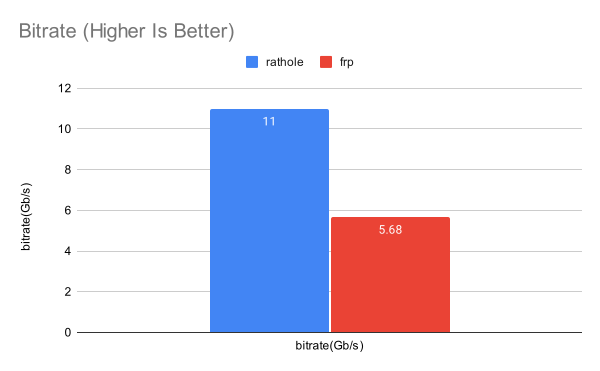

# Benchmark

> Date: 2021/12/14
> 
> Arch Linux with 5.15.7-arch1-1 kernel
>
> Intel i7-6600U CPU @ 2.60GHz
>
> 20GB RAM


## Bitrate



rathole with the following configuration:
```toml
[client]
remote_addr = "localhost:2333"
default_token = "123"

[client.services.foo1]
local_addr = "127.0.0.1:80"

[server]
bind_addr = "0.0.0.0:2333"
default_token = "123"

[server.services.foo1]
bind_addr = "0.0.0.0:5202"
```

frp 0.38.0 with the following configuration:
```ini
[common]
bind_port = 7000
authentication_method = token
token = 1233
```
```ini
# frpc.ini
[common]
server_addr = 127.0.0.1
#server_addr = 47.100.208.60
server_port = 7000
authentication_method = token
token = 1233

[ssh]
type = tcp
local_ip = 127.0.0.1
local_port = 80
remote_port = 5203
```

```
$ iperf3 -v
iperf 3.10.1 (cJSON 1.7.13)
Linux sig 5.15.7-arch1-1 #1 SMP PREEMPT Wed, 08 Dec 2021 14:33:16 +0000 x86_64
Optional features available: CPU affinity setting, IPv6 flow label, TCP congestion algorithm setting, sendfile / zerocopy, socket pacing, authentication, bind to device, support IPv4 don't fragment
$ sudo iperf3 -s -p 80
```

For rathole benchmark:
```
$ iperf3 -c 127.0.0.1 -p 5202
```

For frp benchmark:
```
$ iperf3 -c 127.0.0.1 -p 5203
```

## Latency

nginx/1.20.2 listens on port 80, with the default test page.

frp and rathole configuration is same with the previous section.

Using [ali](https://github.com/nakabonne/ali) with different rate.

e.g. for rathole 10 QPS benchmark:
```
ali -r 10 http://127.0.0.1:5202
```


